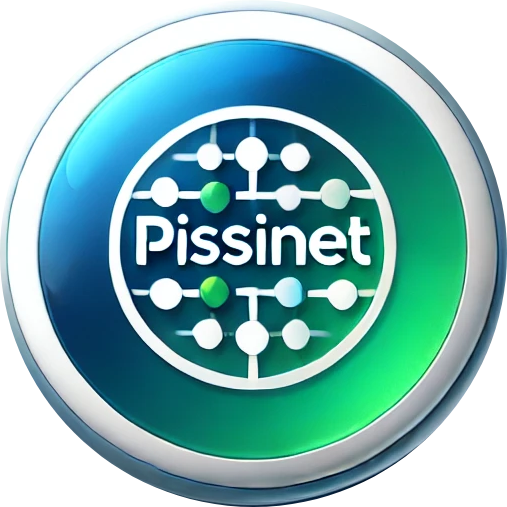

# Gerenciamento de Microempresa

Este aplicativo foi desenvolvido para facilitar o gerenciamento de uma microempresa, integrando diversos processos essenciais em um único sistema. Com ele, é possível administrar clientes, controlar estoques de produtos, gerar relatórios detalhados e realizar vendas tanto via PDV (Ponto de Venda) quanto por comandas.

## Funcionalidades Principais

- **Gerenciamento de Clientes**: Cadastro, edição e exclusão de clientes, com controle de dados como nome, CPF, endereço, telefone e status.
- **Controle de Estoque**: Cadastro e controle de produtos, com informações detalhadas sobre preços, quantidades em estoque, e categorias. Também é possível gerenciar produtos sem controle de estoque.
- **Vendas**: Realização de vendas tanto no formato tradicional (PDV) quanto via comandas, permitindo um processo de venda fluido e eficiente.
- **Relatórios**: Geração de relatórios de vendas, estoque e movimentação financeira para análise do desempenho da empresa.
- **Integração de Comandas**: Controle de vendas associadas a mesas e comandas, com a possibilidade de finalizar a venda e liberar mesas.

> Este sistema foi desenvolvido com foco em simplicidade, eficiência e facilidade de uso, oferecendo tudo o que você precisa para gerenciar sua microempresa de forma integrada e eficiente.

---

## Instalação

Siga estas instruções para configurar o projeto em outro computador.

### Pré-requisitos

- **Python 3.12** ou superior.
- Acesso ao terminal ou prompt de comando.

### Passo a Passo

1. **Baixar e Configurar o Projeto**
   - Clone o repositório ou transfira os arquivos do projeto para o computador desejado:
     ```bash
     git clone https://github.com/Dragonxt022/ProVendas.git
     ```
   - Navegue até a pasta do projeto:
     ```bash
     cd ProVendas
     ```

2. **Criar o Ambiente Virtual**
   - Crie o ambiente virtual:
     ```bash
     python -m venv venv
     ```
   - Ative o ambiente virtual:
     - **Windows**:
       ```bash
       venv\Scripts\activate
       ```
     - **Linux/Mac**:
       ```bash
       source venv/bin/activate
       ```

3. **Instalar Dependências**
   - Instale todas as bibliotecas necessárias:
     ```bash
     pip install -r requirements.txt
     ```

4. **Configurar o Banco de Dados**
   - Realize as migrações do banco de dados:
     ```bash
     python manage.py migrate
     ```
   - (Opcional) Crie um superusuário para acessar o painel de administração:
     ```bash
     python manage.py createsuperuser
     ```
     - Siga as instruções e defina a senha (sugestão padrão: `12345678`).

5. **Executar o Servidor de Desenvolvimento**

    - Navegue até a pasta do projeto:
     ```bash
     cd provendas
     ```
   - Inicie o servidor:
     ```bash
     python manage.py runserver
     ```
   - Acesse o sistema no navegador em [http://127.0.0.1:8000](http://127.0.0.1:8000).

---

## Observações

- **Ambiente de Produção**: Para implantar o sistema em produção, considere usar um servidor web como **Nginx** ou **Apache** com suporte a **HTTPS** para segurança.
- **Banco de Dados**: Se estiver utilizando um banco de dados diferente de `SQLite`, atualize as configurações em `settings.py`.

---

### Contribuição

Sinta-se à vontade para contribuir com o projeto. Abra uma _issue_ ou envie um _pull request_ com melhorias.

---

Desfrute do gerenciamento simples e eficiente para sua microempresa! 🎉
